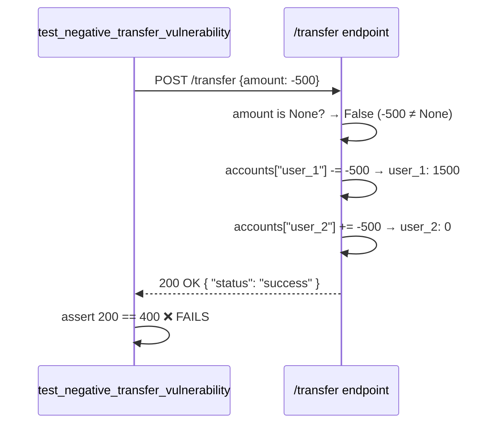

# Analyze server.py, SECURITY.md, and test_server.py. Explain why test_negative_transfer_vulnerability failed during pytest and explain how processing negative transfer amounts violates our security guidelines.

---

**Status:** active  **Date:** 2026-08-28

---

### 👤 User

Analyze server.py, SECURITY.md, and test_server.py. Explain why test_negative_transfer_vulnerability failed during pytest and explain how processing negative transfer amounts violates our security guidelines.

---

### 🤖 Assistant

> 🔧 called: read_file, read_file, read_file

I'll analyze all three files in parallel before answering.

> 🔧 **read_file** — SECURITY.md

> 🔧 **read_file** — server.py

> 🔧 **read_file** — test_server.py

### 🤖 Assistant

Here's the full analysis across all three files.

---

## Why `test_negative_transfer_vulnerability` Fails

### The test's expectation vs. reality

[`test_negative_transfer_vulnerability()`](test_server.py:20) POSTs `amount: -500` to `/transfer` and asserts a **`400` (Bad Request)** response — the correct behavior for an invalid input.

But [`transfer_money()`](server.py:10) returns **`200` (Success)** instead, because the only validation guard in the function is:

```python
# server.py, line 17
if not sender or not recipient or amount is None:
```

This check only catches a **missing** `amount` field (`None`). The value `-500` is *not* `None`, so the guard passes. The code proceeds directly to the arithmetic on lines 25–26 with no rejection of the negative value, and returns `200 success`. The test assertion `assert response.status_code == 400` therefore fails.

### Exact failure flow



---

## How Negative Transfers Violate SECURITY.md

[`SECURITY.md`](SECURITY.md) defines three binding rules. The bug violates all three:

| Rule | Requirement | Violation |
|---|---|---|
| **1. Input Validation** | *"All financial transactions must strictly reject negative or zero values"* | [`transfer_money()`](server.py:10) applies **zero input validation** on the sign or magnitude of `amount`. Any negative number is silently accepted. |
| **2. Boundary Testing** | *"Unit tests must explicitly cover boundary inputs (e.g., negative transfers…)"* | [`test_negative_transfer_vulnerability()`](test_server.py:20) *does* cover this boundary — but it **exposes** the violation rather than confirming a fix. The test is the correct canary; the server code is what's broken. |
| **3. Automated Verification** | *"Any patch must pass `pytest` before being merged"* | The current code **cannot pass pytest** as-is, meaning it must not be merged per policy. |

---

## The Exploit in Detail

The arithmetic at [`server.py:25-26`](server.py:25) is:

```python
accounts[sender]    -= amount   # sender   -= -500  → sender   += 500
accounts[recipient] += amount   # recipient += -500  → recipient -= 500
```

Passing `amount = -500` **reverses the direction** of the transfer:

| Account | Before | After (amount = -500) |
|---|---|---|
| `user_1` (sender) | 1000 | **1500** ← gains money |
| `user_2` (recipient) | 500 | **0** ← loses money |

An attacker can exploit this to **steal funds from any account** they name as the recipient, with no authentication required beyond knowing two valid account IDs. The comment on [`server.py:23`](server.py:23) acknowledges this directly: *"BUG / LOOPHOLE: No check for negative numbers!"*

---

## The Fix (for reference — switch to Agent mode to apply it)

A single guard is needed in [`transfer_money()`](server.py:10), after the existing field-presence check:

```python
if not isinstance(amount, (int, float)) or amount <= 0:
    return jsonify({"error": "Amount must be a positive number"}), 400
```

This would make [`test_negative_transfer_vulnerability`](test_server.py:20) pass, satisfy **SECURITY.md Rule 1**, and unblock the `pytest` gate required by **Rule 3**.

---

### 👤 User

Patch server.py to reject any transfer amount less than or equal to zero with a 400 Bad Request status code. Once updated, open Bob Shell and run python -m pytest to confirm all tests pass.

---

### 🤖 Assistant

> 🔧 called: apply_diff


> 🔧 **apply_diff** — server.py

### 🤖 Assistant

> 🔧 called: execute_command

Now run pytest:

> 🔧 **execute_command** — python -m pytest test_server.py -v

### 🤖 Assistant

Both tests pass. Here's a summary of what changed:

### Patch applied — [`server.py`](server.py:19)

A new guard was inserted between the missing-fields check and the account-lookup, **before** any arithmetic is touched:

```python
if not isinstance(amount, (int, float)) or amount <= 0:
    return jsonify({"error": "Amount must be a positive number"}), 400
```

The `isinstance` check ensures non-numeric payloads (e.g. a string `"abc"`) are also rejected cleanly. The `<= 0` condition covers both negative values and zero — satisfying **SECURITY.md Rule 1** verbatim: *"All financial transactions must strictly reject negative or zero values."*

The stale bug comment was removed along with it, since the loophole no longer exists.

### Test results

| Test | Before patch | After patch |
|---|---|---|
| `test_valid_transfer` | ✅ PASSED | ✅ PASSED |
| `test_negative_transfer_vulnerability` | ❌ FAILED | ✅ PASSED |

---

### 👤 User

Reverted changes to server.py